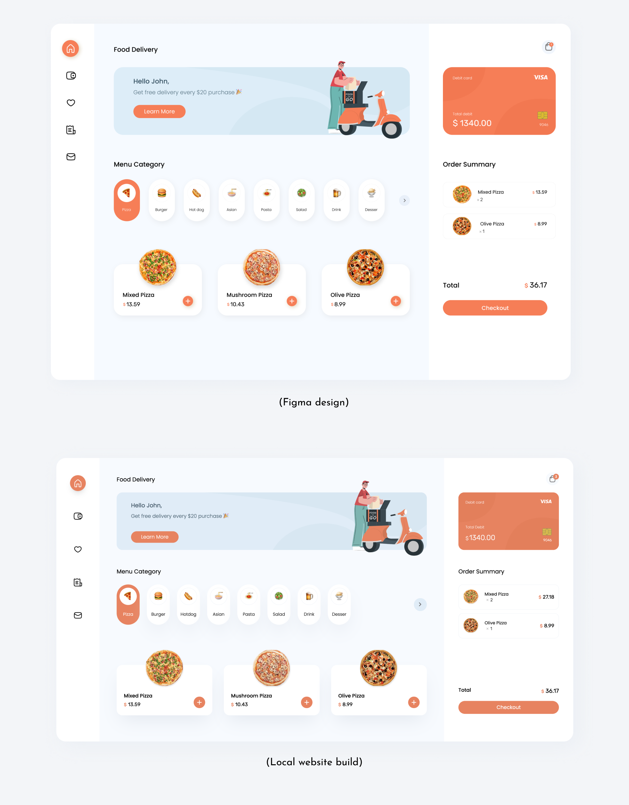

# Food Delivery App

A simple demo of food delivery app using React, to practice working with [Tailwind](https://tailwindcss.com/) and [Redux-Toolkit](https://redux-toolkit.js.org/).

This demo project illustrates the fusion of Tailwind CSS and Redux Toolkit in the context of a food delivery application. It offers a simple yet comprehensive example of how to build an appealing UI while effectively managing the application's state.

## Demo

Check out live demo here 👇.
https://simindev.github.io/Food-Delivery/

## UI Design

I personally designed the user interface using the [Figma](https://figma.com/) platform, drawing inspiration from various designs showcased on Dribbble. This endeavor marks my inaugural encounter with [Tailwind](https://tailwindcss.com/), as the entirety of the styling was accomplished through its utilization./

See the comparison of the Figma design and the local website build in the image below.

### To Do

- Make it responsive

### Technologies and Tools

- Figma
- Create React App
- Tailwind
- React-Router-Dom v6
- Redux-Toolkit
